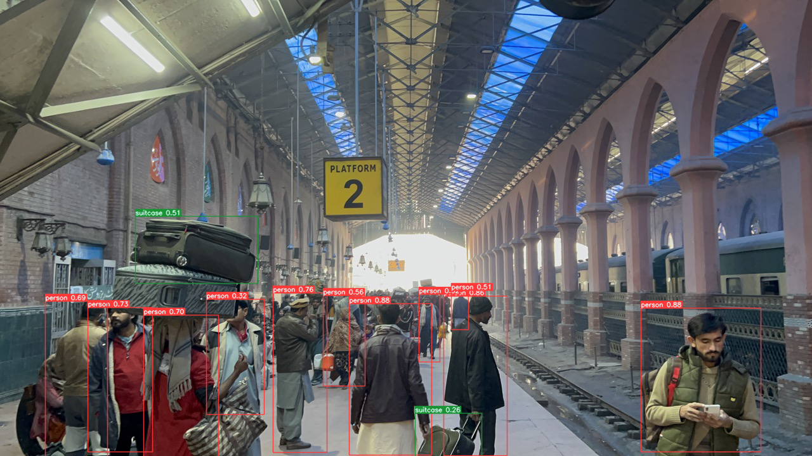

# Chip's Challenge

> Help Chip solve problems using OpenVINO™! Upskill your AI techniques, show off to friends, and create a solution for a chance to win cool prizes.

---

### Tools Used

```
- open-vino
- python3
- jupyter-notebook
- colab
```

### Working

> Input Image


> Output Image



---

> Leverage the power of open-vino today !